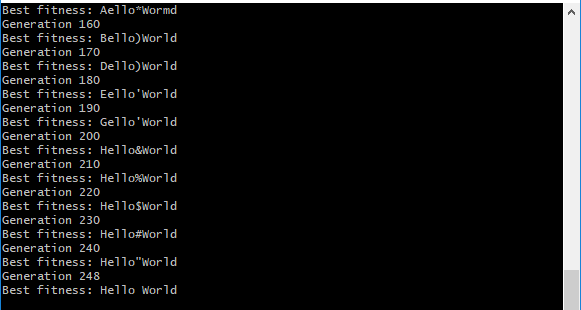
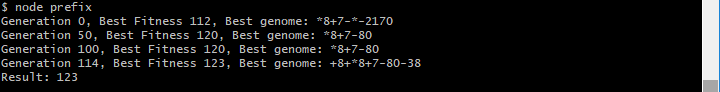
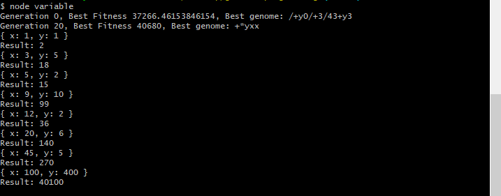

Genetic Programming
-------------------

Genetic programming is a branch of artificial intelligence that uses evolutionary computation to generate computer programs for solving a particular task. The computer programs are represented by encoded genes and slightly modified at each time-step via cross-over and mutation until a resulting program is found that solves the given task to a degree of accuracy.

This project hosts a demo of several genetic algorithm and genetic programming examples written in JavaScript with the [genetic-js](https://github.com/subprotocol/genetic-js) library.

- Hello World

  *A traditional "hello world" example for genetic algorithms, where the goal is to output the text, "Hello World".*

  

- Prefix

  *A genetic programming example where a computer program is evolved to represent a specific mathematical expression, in prefix notation format.*

  

- Variable

  *A genetic programming example where a computer program is evolved to represent a mathematical expression containing both numbers and variables (i.e., formulas ) in prefix notation format.*

  

## Genetic Algorithms in JavaScript

The [genetic-js](https://github.com/subprotocol/genetic-js) library facilitates the construction of a genetic algorithm in JavaScript. It provides the necessary functions and handlers for defining a genetic algorithm, its initialization, a fitness function, and a means for ranking solutions. In this manner, a genetic algorithm can be developed for a large variety of tasks, and as shown in this project, genetic programming.

## Initialization

Usage of the genetic algorithm library in node.js is relatively straight-forward. You can begin by instantiating the genetic class and selecting an optimization method and selection algorithm.

```js
const Genetic = require('genetic-js');

const genetic = Genetic.create();
genetic.optimize = Genetic.Optimize.Maximize;
genetic.select1 = Genetic.Select1.Tournament2;
genetic.select2 = Genetic.Select2.Tournament2;
```

In the above example, we've instantiated the genetic class and selected to maximize the fitness among the pool of genomes. The best performing results will continue on to the next epoch of evolution.

## Creating the Initial Population

After creating the initial genetic algorithm class, you can provide a function of creating the initial pool of genomes to begin evolution from. This set of genomes is usually randomly produced, with some of the genomes performing better than others for solving the desired task. It's these better performing genomes that will rank high and move on to the next epoch of evolution, creating the next generation.

```js
genetic.seed = function() {
  // Return a random string for this particular genome.
  return 'abc';
}
```

## Crossover

When creating the next population of genomes after an epoch, the methods of crossover and mutation are used to slightly modify the existing genomes and create children. Crossover is the process of creating a child genome by taking two parent genomes and mating them together to produce offspring. This is done by taking a series of genes from parent 1 and parent 2 and combining them together to form a child. Additional mutation can be used on the child to slightly tweak the genes further, which has the potential to produce beneficial (or worse) functionality for the child.

A simplified example for performing crossover on two parent genomes to produce two child genomes is shown below.


```js
genetic.crossover = function(parent1, parent2) {
  let index = Math.floor(Math.random() * parent1.length);

  const parent1Left = parent1.substr(0, index);
  const parent1Right = parent1.substr(index);

  const parent2Left = parent2.substr(0, index);
  const parent2Right = parent2.substr(index);

  // Crossover the left and right side.
  let child1 = parent1Left + parent2Right;
  let child2 = parent2Left + parent1Right;

  return [child1, child2];
}
```

In the above code, we're simply splitting the two parent genomes at a specific index. We then take the left portion of one parent and combine it with the right portion of the other parent to produce a child offspring. We repeat this a second time for the second child offspring, by taking the right portion of the first parent and combine it with the left portion of the second parent.

## Mutation

After performing crossover, each child genome can be slightly modified a bit further by mutating specific genes. This may or may not produce beneficial effects that can boost the child's resulting fitness score. Mutation can be performed by randomly altering the value of a gene or by inserting and removing genes at specific indices within the genome.

```js
genetic.mutate = function(entity) {
  const replaceAt = (str, index, replacement) => {
    return str.substr(0, index) + replacement + str.substr(index + replacement.length);
  };

  let index = Math.floor(Math.random() * entity.length);

  // Mutate the instruction up or down by 1 place (according to the direction).
  const direction = Math.floor(Math.random() * 2);
  return replaceAt(entity, index, String.fromCharCode(entity.charCodeAt(index) + (direction ? 1 : -1)));
}
```

In the above code, we're performing mutation by replacing a randomly selected single gene within the child. We modify the gene by either incrementing or decrementing it by a value of 1. In the case of letters representing the genes, this would select either the previous or next letter within the alphabet. For numbers, this may add or subtract some fraction from the original value.

## Fitness

Scoring the fitness for a genome is the most important task of developing a genetic algorithm, as this contains the core logic for guiding which genomes are to be selected for producing the next generation of genomes and thus, solving a particular task. A granular method of scoring the fitness for each genome is required in order to allow the genetic algorithm to rank genomes accordingly, even if they don't solve the entire given task. By assigning partial credit to those genomes which perform just slightly better than others, the evolution process can select better performing programs in a granular fashion until it arrives at a solution.

```js
genetic.fitness = function(entity) {
  let score = 0;

  for (let i=0; i<this.userData.solution.length; i++) {
    score += 256 - Math.abs(entity.charCodeAt(i) - this.userData.solution.charCodeAt(i));
  }

  return score;
}
```

In the above example, we're simply scoring the fitness according to how close each letter within the genome is to the target letter. For example, to output the string "Hello World", if the first letter in genome 1 is a 'G' and the first letter in genome 2 is a 'T', then the first genome will be ranked higher by fitness, since 'G' is closer to 'H' (the first target letter) than 'T'. Of course, the entire score for the genome is taken into account. If the second genome had a worse score for the first gene ('T'), but had all of its other genes (i.e., letters) closer to the solution, then it would end up with a higher scoring fitness and thus move on to the next generation.

## Termination

Ending the selection process for a genetic algorithm can be done by specifying a target fitness score or a target solution. This can be done by simply comparing the fitness of the highest ranking genome against the expected target solution.

```js
genetic.generation = function(pop, generation, stats) {
  return pop[0].fitness < this.userData.solution.length * 256;
}
```

In the above example, we're taking the highest ranking genome `pop[0]` and checking its fitness score. For the case of outputting the string "Hello World", if all of its characters are correct for the target string, then its fitness will be a perfect score of `256 * solution.length`, or a score of `256` for each letter in the string.

## Displaying Status While Evolving

It can be helpful to view the output during the evolution process. This can be done by implementing the notification method as shown below.

```js
genetic.notification = function(pop, generation, stats, isDone) {
  const value = pop[0].entity;

  console.log(`Generation ${generation}`);
  console.log(`Best fitness: ${value}`);
}
```

In the above example, we're simply outputting the generation number along with the best performing genome (which in the case, is encoded as a set of letters - i.e., the text that we're trying to generate).


## Running the Genetic Algorithm

To run the genetic algorithm and start the evolutionary process, we simply call the `evolve` method. A number of configuration parameters can be provided, including the maximum iterations, population size, crossover rate percentage, and mutation rate percentage. We can also store data for use by our methods (such as the target string to be generated, etc.).

```js
genetic.evolve({
  iterations: 100000,
  size: 100,
  crossover: 0.3,
  mutation: 0.3,
  skip: 10 /* frequency for notifications */
}, {
  solution: 'Hello World'
})
```

## Hello World

## Prefix

Prefix Expression Notation

The goal is for the AI to write a program that calculates the value for 123 using prefix notation.

```
+8+*8+7-80-38
```

Postfix Expression Notation

```
88780-+*38-++
```

Infix Translation

```text
Step 1: 8 - 0 = 8
Step 2: 7 + 8 = 15
Step 3: 8 * 15 = 120
Step 4: 3 - 8 = -5
Step 5: 120 + -5 = 115
Step 6: 8 + 115 = 123
```

## Variable

Prefix Expression Notation

The goal is for the AI to write a program that calculates (X * Y) + X using prefix notation, for any given value of X and Y.

```
+*yxx
```

Postfix Expression Notation

```
yx*x+
```

Solving for (X=2, Y=5)

```
5 2 * 2 +
```

Infix Translation

```text
Step 1: 5 * 2 = 10
Step 2: 10 + 2 = 120
```

Solving for (X=10, Y=20)

```text
20 10 * 10 + = 210
```

Solving for (X=8, Y=100)

```text
100 8 * 8 + = 808
```

Solving for (X=41, Y=62)

```text
62 41 * 41 + = 2583
```

## License

MIT

## Author

Kory Becker http://www.primaryobjects.com
